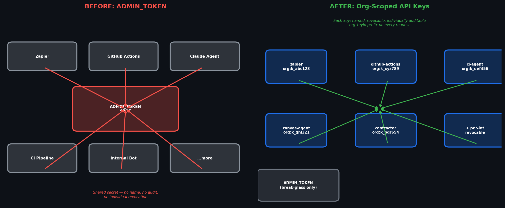

# Named, Revocable, Audited: Org-Scoped API Keys for AI Agent Platforms

Your Molecule AI tenant has a secret that can do everything: create workspaces, read secrets, rotate credentials, import org definitions, mint more tokens.

That secret is `ADMIN_TOKEN`.

You've probably been warned not to share it. You've probably also shared it — to Zapier, to a CI pipeline, to the AI agent you're trying to get productive. Because that's what it was designed for. A single bootstrap credential that unlocks everything.

The problem isn't that you shared it. The problem is the model itself. One shared secret with no name, no audit trail, and no way to revoke it without taking down every integration that holds a copy.

Org-scoped API keys solve this. Every key is named, individually revocable, and carries an `org:keyId` prefix through every request. Mint one for Zapier, one for your GitHub Actions deploy agent, one for the AI agent you're running in production. When something goes wrong — or when a contractor leaves — revoke one key. Nothing else breaks.

## Why ADMIN_TOKEN is a single point of failure

`ADMIN_TOKEN` has three problems that compound at scale:

**No name.** When the token is compromised or needs rotation, you have to find every copy. The CI pipeline, the Zapier webhook, the internal bot, the agent's environment file. One missed copy means a window where the old token still works.

**No revocation granularity.** Rotate `ADMIN_TOKEN` and you break every integration simultaneously. There's no "revoke the Zapier access but keep the GitHub Actions one" — it's all or nothing. This makes rotation a coordination event rather than a surgical action.

**No audit trail.** A request hits `/workspaces`. Was that Zapier? The deploy agent? The AI agent doing its nightly sweep? You can't tell from logs alone — only the `Authorization: Bearer` header, and that header is the same value everywhere.

For a team of 10 with one or two integrations, this is manageable friction. For a team running a production agent fleet — contractors, AI agents, pipelines, third-party webhooks — it's an operational hazard.

## What org-scoped keys give you

Mint a key from the canvas UI (Settings → Org API Keys → New Key) or from the CLI:

```bash
curl -X POST https://acme.moleculesai.app/org/tokens \
  -H "Authorization: Bearer $ADMIN_TOKEN" \
  -d '{"name": "zapier-webhook"}'
```

The response returns the full plaintext token **once**. Copy it, store it in your secret manager, and hand it to Zapier.

Now when Zapier calls your tenant, logs show:

```
org:keyId=zpier-wh_abc123  last_used_at=2026-04-22T09:14:22Z
```

You know exactly which integration made which call. When someone leaves or a hook gets compromised:

```bash
curl -X DELETE https://acme.moleculesai.app/org/tokens/zapier-webhook \
  -H "Authorization: Bearer $ADMIN_TOKEN"
```

The key stops working. Immediately. Nothing else touches.

## Keys and the AI agent angle

AI agents are a specific case worth calling out. When you hand an agent an `ADMIN_TOKEN`, you're giving it full org admin — the same access as a logged-in admin user. That's fine for bootstrapping. It's not fine for ongoing production use.

With org-scoped keys:

1. Create a key for the agent with a descriptive name (`ci-agent-prod`, `canvas-assistant`)
2. Give the agent only that key
3. The agent can do everything it needs — create workspaces, manage secrets, dispatch tasks
4. If the agent behaves unexpectedly, revoke the one key

The `created_by` field on every token records provenance — `"session"`, `"org-token:zpier-wh"`, or `"admin-token"` — so post-incident review can follow the chain of mints. If a key minted by another key is used maliciously, the audit trail goes back to the original minting identity.

## The security model

Plaintext tokens are never stored. The database holds a sha256 hash. A DB compromise gives the attacker hashes — not usable credentials. Cracking sha256 of a 43-character base64url random string at GPU-scale brute force would take longer than the age of the universe.

Revocation is immediate: `UPDATE revoked_at = now()` takes microseconds. The partial index on `WHERE revoked_at IS NULL` keeps the hot-path lookup O(log n) regardless of how many tokens have been minted and revoked over the tenant's lifetime.

The failure response is collapsed — `Validate()` returns `ErrInvalidToken` for bad bytes, revoked tokens, deleted tokens, and never-existed tokens. An attacker can't enumerate which case applies from the response shape.

## What's next

Org-scoped keys today are full-admin. Role scoping (admin / editor / read-only) and per-workspace bindings are the next layer. The goal: an agent gets the minimum access it needs, not full org admin by default.

Expiry and TTL are also on the roadmap. Today, keys live until revoked — fine for long-lived integrations, less ideal for short-lived scripts.

Until then: name your keys, store them in a secret manager, and revoke any key the moment it touches a system it shouldn't have.



*Org-scoped API keys are live now on all Molecule AI deployments. Mint your first key in Settings → Org API Keys in the canvas UI.*